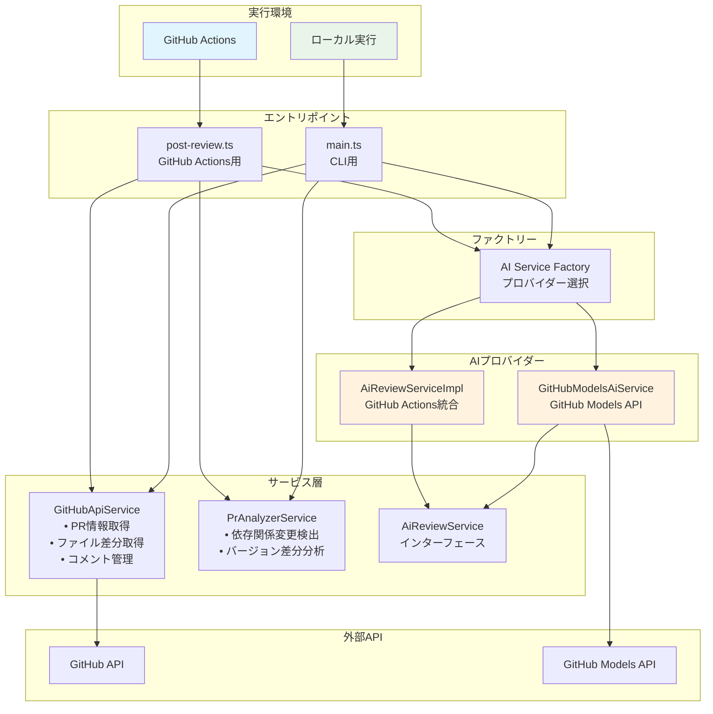
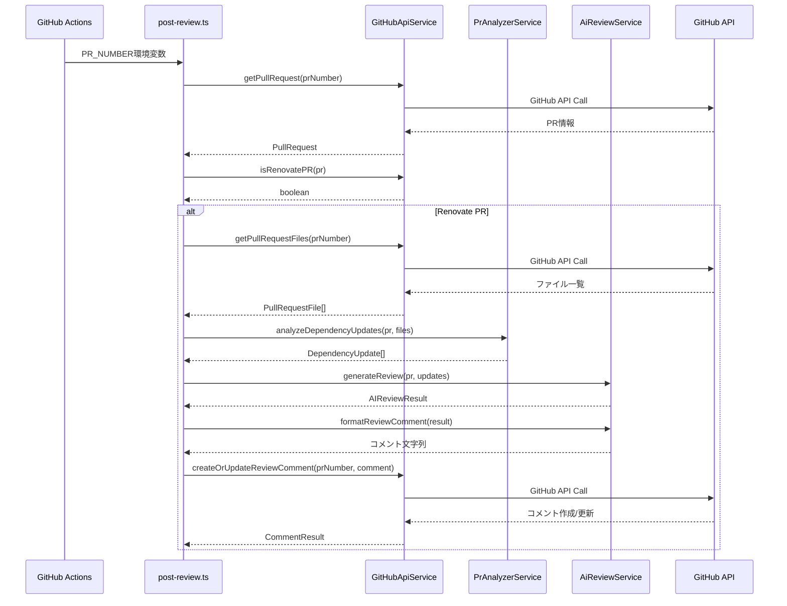

# システムアーキテクチャ

## 概要

AI依存関係レビューシステムは、Renovate等のbot作成のPRに対してAIによるセキュリティ・コンパチビリティ分析を行い、レビューコメントを自動投稿するシステムです。

## システム構成

## データフロー

## コンポーネント詳細

### 1. エントリポイント

#### post-review.ts
- **役割**: GitHub Actions環境での実行
- **機能**: 
  - 環境変数から設定取得
  - AI_REVIEW環境変数が設定されている場合はそれを直接使用
  - そうでない場合はローカルAI処理にフォールバック
  - GitHub Actions Step Summaryの生成

#### main.ts  
- **役割**: ローカル開発・デバッグ用CLI
- **機能**:
  - コマンドライン引数の処理
  - PR解析とAIレビューの実行
  - コンソール出力での詳細ログ

### 2. サービス層

#### GitHubApiService
- **ファイル**: `src/services/github-api.ts`
- **責務**: GitHub API操作の抽象化
- **主要機能**:
  - `getPullRequest()`: PR情報取得
  - `getPullRequestFiles()`: 変更ファイル一覧取得
  - `createOrUpdateReviewComment()`: AIコメントの作成/更新
  - `isRenovatePR()`: Renovate PR判定

#### PrAnalyzerService
- **ファイル**: `src/services/pr-analyzer.ts`
- **責務**: PR内容の解析
- **主要機能**:
  - `analyzeDependencyUpdates()`: 依存関係変更の検出
  - `extractVersionChanges()`: バージョン差分の抽出
  - `determineChangeType()`: 変更種別判定(major/minor/patch)

#### AiReviewService (インターフェース)
- **ファイル**: `src/services/ai-review.ts`
- **責務**: AIレビュー処理の抽象化
- **主要機能**:
  - `generateReview()`: AIレビュー生成
  - `formatReviewComment()`: レビューコメント整形

### 3. AI プロバイダー層

#### AiReviewServiceImpl
- **ファイル**: `src/services/ai-review.ts`
- **実装**: GitHub Actions統合
- **特徴**:
  - `actions/ai-inference@v1`アクションとの連携
  - `AI_REVIEW`環境変数からレスポンス取得
  - レスポンス解析とパース処理

#### GitHubModelsAiService  
- **ファイル**: `src/services/github-models-ai.ts`
- **実装**: GitHub Models Direct API
- **特徴**:
  - GitHub Personal Access Tokenによる認証
  - Azure REST APIクライアント使用
  - エラー時のフォールバック機能

### 4. ファクトリーパターン

#### AI Service Factory
- **ファイル**: `src/services/ai-service-factory.ts`
- **役割**: AIプロバイダーの動的選択
- **設定**:
  - `AI_PROVIDER`環境変数: `github-actions` | `github-models`
  - プロバイダー固有設定の受け渡し

## 設定管理

### 環境変数

| 変数名 | 必須 | 説明 |
|--------|------|------|
| `GITHUB_TOKEN` | ✓ | GitHub API認証 |
| `GITHUB_REPOSITORY` | ✓ | リポジトリ（owner/repo形式） |
| `PR_NUMBER` | ✓ | 対象PR番号 |
| `AI_PROVIDER` | - | AIプロバイダー選択（デフォルト: github-actions） |
| `AI_MODEL` | - | AIモデル（GitHub Models用） |
| `AI_ENDPOINT` | - | APIエンドポイント（GitHub Models用） |
| `AI_REVIEW` | - | 事前生成されたAIレビュー |

### 型定義

- **Config**: `src/types/config.ts` - 設定インターフェース
- **GitHub**: `src/types/github.ts` - GitHubデータ型定義

## 拡張性

### 新しいAIプロバイダーの追加

1. `AiReviewService`インターフェースを実装
2. `ai-service-factory.ts`に新プロバイダーを追加
3. 必要に応じて環境変数設定を追加

### 新しい依存関係エコシステムの対応

1. `PrAnalyzerService.isDependencyFile()`にファイル判定を追加
2. `getEcosystem()`にエコシステム識別を追加
3. `extractPackageName()`にパース処理を追加

## セキュリティ考慮事項

- GitHub Personal Access Tokenの安全な管理
- AIレビューコメントの識別子による既存コメント保護
- API呼び出し失敗時の安全なフォールバック処理

## テスト戦略

- 各サービス層の単体テスト
- モックデータを使用した統合テスト
- 環境変数アクセステスト（`--allow-env`フラグ必須）